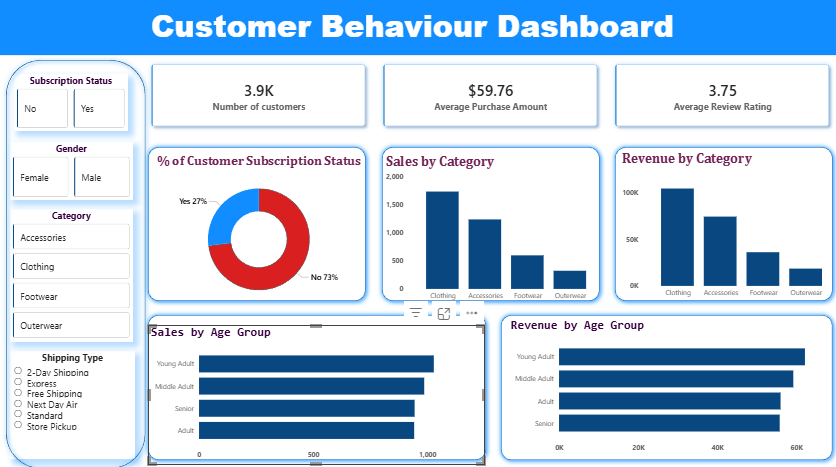

# 🛍️ Customer Shopping Behavior Analysis

## 📌 Overview
This project focuses on analyzing customer shopping behavior using transactional data. The goal is to extract meaningful insights related to customer preferences, spending patterns, and business performance to support data-driven decision-making.

The project follows a complete data analytics workflow including data cleaning, exploratory data analysis (EDA), SQL-based querying, and dashboard visualization.

---

## 📊 Dataset
- Total Records: ~3,900 transactions  
- Features include:
  - Customer demographics (Age, Gender, Location, Subscription Status)
  - Purchase details (Item, Category, Amount, Season, Size, Color)
  - Shopping behavior (Discount Applied, Frequency, Review Rating, Shipping Type)

---

## 🛠️ Tools & Technologies
- **Python (Jupyter Notebook)** – Data cleaning & EDA  
- **SQL (PostgreSQL / MySQL / SQL Server)** – Data analysis  
- **Power BI** – Interactive dashboard  
- **Excel** – Dataset storage  
- **Gamma (PPT)** – Presentation creation  

---

## 🔄 Project Workflow

### 1. Data Loading & Cleaning (Python)
- Imported dataset using pandas  
- Handled missing values (Review Ratings)  
- Renamed columns for consistency  
- Performed feature engineering (age groups, purchase frequency)

### 2. Exploratory Data Analysis (EDA)
- Analyzed distributions and trends  
- Identified patterns in customer behavior  
- Checked relationships between variables  

### 3. SQL Analysis
Performed business-focused queries such as:
- Revenue by gender  
- Top-rated products  
- Customer segmentation (New, Returning, Loyal)  
- Discount impact on purchases  
- Subscription behavior analysis  

### 4. Dashboard Creation (Power BI)
- Built an interactive dashboard  
- Visualized sales, revenue, and customer insights  
- Enabled filtering by category and customer attributes  

### 5. Reporting & Presentation
- Created a detailed project report  
- Designed a presentation using Gamma for storytelling  

---

## 📈 Dashboard

---

## 🔍 Key Results & Insights
- Clothing category generates the highest sales and revenue  
- Majority of customers are non-subscribers  
- Repeat customers show higher likelihood of subscription  
- Discounts influence purchase behavior but need optimization  
- Certain age groups contribute more to overall revenue  

---
## 📁 Project Structure

Customer-Shopping-Behavior-Analysis/
│
├── notebooks/
│   └── analysis.ipynb
│
├── sql/
│   └── queries.sql
│
├── dashboard/
│   └── dashboard.pbix
│
├── images/
│   └── dashboard.png
│
├── data/
│   └── shopping_data.csv / shopping_data.xlsx
│
├── presentation/
│   └── project.pptx
│
├── project_report.pdf
└── README.md

## ▶️ How to Run

1. Open the Jupyter Notebook (`.ipynb`) to view data cleaning and analysis.
2. Run the SQL queries in your preferred database (PostgreSQL / SQL Server).
3. Open the Power BI file (`.pbix`) to explore the dashboard.

## 🚀 Conclusion

This project showcases an end-to-end data analytics workflow, combining Python, SQL, and Power BI to transform raw data into actionable insights. It highlights key trends in customer behavior, purchasing patterns, and revenue distribution, enabling data-driven decision-making and strategic business improvements.
